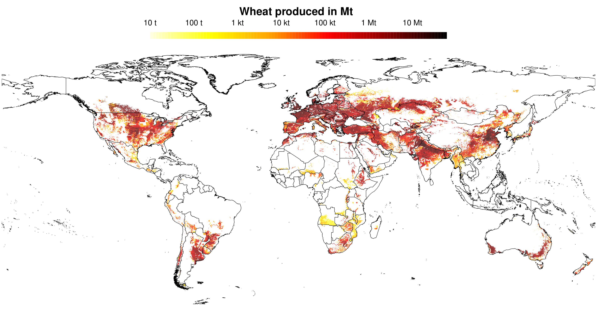
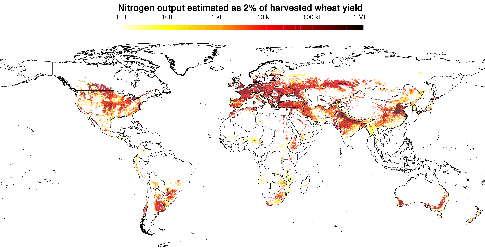
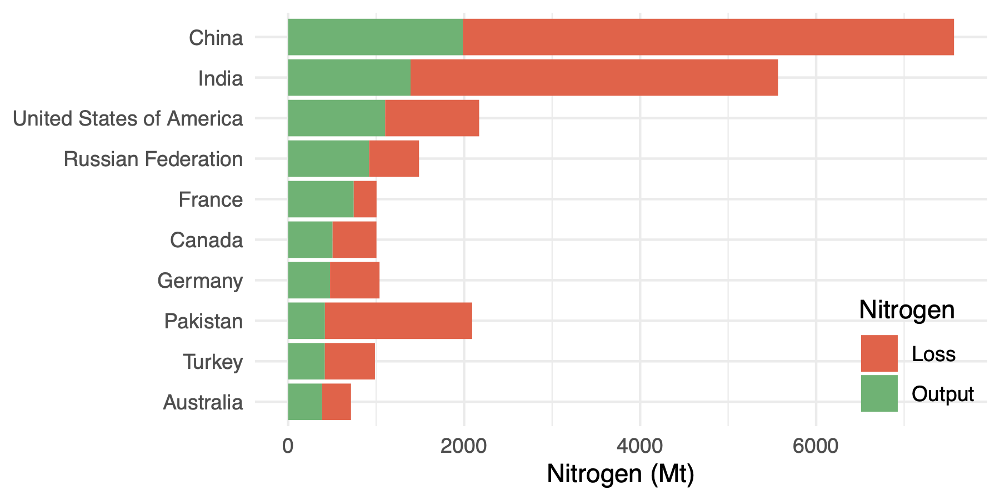

```{r setup, include=FALSE}
knitr::opts_chunk$set(echo=TRUE, eval=FALSE)
```

```{r load_libraries, eval=TRUE, message=FALSE}

library(terra) # to deal with raster files
library(sf) # to handle spatial files and data
library(sp) # similar to sf, but an older package
library(ggplot2) # plotting
library(dplyr) # data manipulation
library(tidyr) # data manipulation
library(rasterVis) # visualizing raster data
```

## Reading in data

To read in the various datasets, we'll use the the following packages. To read in the raster data from the SPAM dataset, we'll use the R package `terra` (instead of `raster`), to read in the shape files from the GAUL dataset, we'll use the R package `sf`, and to read in csv files from the NUE dataset, we'll use `read.csv` function from the `utils` package.

```{r load_data, eval=TRUE}

# SPAM raster dataset
yield <- rast(file.path("data", "SPAM_2005_v3.2", "SPAM2005V3r2_global_Y_TA_WHEA_A.tif"))
harvested_area <- rast(file.path("data", "SPAM_2005_v3.2", "SPAM2005V3r2_global_H_TA_WHEA_A.tif"))
physical_area <- rast(file.path("data", "SPAM_2005_v3.2", "SPAM2005V3r2_global_A_TA_WHEA_A.tif"))

# GAUL dataset
subnational_boundaries <- st_read(file.path("data", "GAUL", "g2015_2005_2.shp"))

# NUE dataset from Zhang et al 2015
nue <- read.csv(file.path("data", "NUE_Zhang_et_al_2015", "Country_NUE_assumption.csv"))
```

## Creating national boundaries

In order to visualize raster data, we'll aggregate the `sf` object corresponding to the sub-national boundaries to create national boundaries. We also further convert these to "Spatial" object from the `sp` library to visualize using the `levelplot` function from the `rasterVis` package.

```{r create_national_boundaries}

# Aggregate sub-national administrative boundaries into national boundaries
# This might take a minute or two to run
national_boundaries <- aggregate(subnational_boundaries["ADM0_NAME"], by = list(subnational_boundaries$ADM0_NAME), FUN = function(x) x[1])

# Convert into a "Spatial" object of sp library for visualization via levelplot of rasterVis
national_boundaries_sp <- as(national_boundaries, "Spatial")
```

```{r simplify_for_faster_plotting}

# Simplify national boundaries via st_simplify
# If simplify doesn't work on any particular nation's geometry, then retain the geometry as is
national_boundaries_simplified <- st_sf(do.call(rbind, lapply(1:nrow(national_boundaries), function(i) {
  tryCatch({
    st_simplify(national_boundaries[i,], dTolerance=0.1, preserveTopology=TRUE)
  }, error=function(e) national_boundaries[i,])
})))

# Convert into a "Spatial" object of sp library for visualization via levelplot of rasterVis
national_boundaries_simplified_sp <- as(national_boundaries_simplified, "Spatial")
```

## Question 1

### Calculating wheat production

```{r calculate_production}

# Calculate production in million tons (Mt)
production <- yield*harvested_area/1e6
names(production) <- "layer"

# Create an outputs folder
if (!dir.exists("outputs")) {
  dir.create("outputs", recursive = TRUE)
}

# Write to a GeoTIFF file using writeRaster from terra
terra::writeRaster(production, filename=file.path("outputs", "wheat_production_Mt.tif"), overwrite=TRUE)
```

### Visualizing wheat produced (raster data)

To plot the wheat produced (raster) along with the maps of various countries, we use the `levelplot` function from `rasterVis` package. We plot the values on log-scale for better visualization.

```{r plotting_production_log}

# Plotting

# Create a color palette going from light yellow to orange to dark red to black
col_fun <- colorRampPalette(c("lightyellow", "yellow", "orange", "red", "darkred", "black")) 

# production <- rast(file.path("outputs", "wheat_production_Mt.tif"))
# Create a new variable with log10 values of wheat produced
log_production <- terra::app(production, fun = function(x) { log(x, base=10) })

p <- levelplot(
  log_production,
  maxpixels = ncell(log_production),
  col.regions = col_fun(100),
  at = seq(-5, minmax(log_production)[2], length.out = 101),
  margin = FALSE,
  scales = list(draw=FALSE),
  main = "Wheat produced in Mt",
  xlab = NULL,
  ylab = NULL,
  border = NA,
  par.settings = list(axis.line = list(col=NA)),
  # Colorbar options
  colorkey = list(
                at = seq(-5, minmax(log_production)[2], length.out = 101),
                labels = list(
                  labels = c("10 t", "100 t", "1 kt", "10 kt", "100 kt", "1 Mt", "10 Mt"),
                  at = seq(-5, 1, by = 1)
                ),
                space = "top",
                width = 1,
                height = 0.5,
                just = c("center", "top"),
                margin = c(0, 0, 20, 0)
          ),
  # Add national boundaries
  panel = function(x, y, z, ...){
    panel.levelplot(x, y, z, ...)
    sp.lines(national_boundaries_simplified_sp, lwd = 0.5, col = "black")
  }
)
pdf(file.path("outputs", "Wheat_produced.pdf"), width = 11, height = 8)
print(p)
dev.off()

```

#### Figure 1: Wheat produced (in Mt) in different regions of the world



## Question 2

### Wheat production by country

To aggregate production to country level, we first use `extract` from `terra` to extract production for the various sub-national regions as specified by the GAUL dataset. Then we group by country and sum up the production values for each group (country).

```{r extract_subnational_production_and_aggregate_to_country}

# Extract wheat produced for all regions in the GAUL dataset
subnational_production <- terra::extract(production, subnational_boundaries, df = TRUE)

# Create a column Country based on ADM0_NAME column
subnational_production$Country <- subnational_boundaries$ADM0_NAME[subnational_production$ID]

# Group by Country and sum
national_production <- subnational_production %>%
  group_by(Country) %>%
  summarise(production_Mt = sum(layer, na.rm = TRUE))

# Write to csv file
write.csv(national_production, file.path("outputs", "wheat_production_Mt_by_country.csv"), row.names = FALSE)
```

```{r display_national_production, results='asis', eval=TRUE, echo=FALSE}

library(knitr)
library(rmarkdown)

options(scipen=999)
national_production <- read.csv(file.path("outputs", "wheat_production_Mt_by_country.csv"))
national_production <- national_production[order(national_production$production_Mt, decreasing=TRUE), ]
national_production[, 2] <- sapply(national_production[, 2], function(x) {
  ifelse(x == round(x), as.integer(x), round(x, 2))
})
paged_table(national_production)

```

## Question 3

### Nitrogen output in harvested wheat

Assuming that 2% of harvested wheat consists of nitrogen, we calculate the nitrogen output and save it to a GeoTIFF file. To plot, we use `levelplot` again.

```{r calculate_nitrogen_output_from_wheat_production}

# Calculate Nitrogen as 2% of wheat produced
nitrogen_output <- production*0.02

# Write to GeoTIFF raster
terra::writeRaster(nitrogen_output, filename=file.path("outputs", "nitrogen_output_Mt.tif"), overwrite=TRUE)

```

```{r plotting_Nitrogen_output_log}

# Plotting

col_fun <- colorRampPalette(c("lightyellow", "yellow", "orange", "red", "darkred", "black")) 

# nitrogen_output <- rast(file.path("outputs", "nitrogen_output_Mt.tif"))
# Create a new variable with log10 values of nitrogen in wheat harvested
log_nitrogen_output <- terra::app(nitrogen_output, fun = function(x) { log(x, base=10) })

p <- levelplot(
  log_nitrogen_output,
  maxpixels = ncell(nitrogen_output),
  col.regions = col_fun(100),
  at = seq(-5, minmax(log_nitrogen_output)[2], length.out = 101),
  margin = FALSE,
  scales = list(draw=FALSE),
  main = "Nitrogen output estimated as 2% of harvested wheat yield",
  xlab = NULL,
  ylab = NULL,
  border = NA,
  par.settings = list(axis.line = list(col=NA)),
  # Colorbar options
  colorkey = list(
                at = seq(-5, minmax(log_nitrogen_output)[2], length.out = 101),
                labels = list(
                  labels = c("10 t", "100 t", "1 kt", "10 kt", "100 kt", "1 Mt"),
                  at = seq(-5, 0, by = 1)
                ),
                space = "top",
                width = 1,
                height = 0.5,
                just = c("center", "top"),
                margin = c(0, 0, 20, 0)
          ),
  # Add national boundaries
  panel = function(x, y, z, ...){
    panel.levelplot(x, y, z, ...)
    sp.lines(national_boundaries_simplified_sp, lwd = 0.5, col = "black")
  }
)
pdf(file.path("outputs", "Nitrogen_output.pdf"), width = 11, height = 8)
print(p)
dev.off()

```

#### Figure 2: Nitrogen output from harvested wheat (in Mt) in different regions of the world



## Question 4

### Top 10 wheat producing countries and nitrogen in wheat

```{r top_10_wheat_producing_countries}

# national_production <- read.csv("wheat_production_Mt_by_country.csv")

top_10_countries <- national_production %>% 
    top_n(10, wt = production_Mt) %>% 
    arrange(desc(production_Mt))

# USA and Russia have different names in the GAUL and NUE datasets, modifying them to ensure compatibility
nue$Country[nue$Country == "USA"] <- "United States of America"
nue$Country[nue$Country == "RussianFed"] <- "Russian Federation"

top_10_countries <- merge(top_10_countries, nue, by = "Country")  %>% 
    arrange(desc(production_Mt))

top_10_countries$Output <- top_10_countries$production_Mt * 0.02
top_10_countries$Input <- top_10_countries$Output / top_10_countries$NUE
top_10_countries$Loss <- top_10_countries$Input - top_10_countries$Output

write.csv(top_10_countries, file.path("outputs", "top10_countries_nitrogen.csv"), row.names=FALSE)
```

```{r display_nitrogen_outputs_losses_top_10_countries, results='asis', eval=TRUE, echo=FALSE}

library(knitr)
library(rmarkdown)

options(scipen=999)
top_10_countries <- read.csv(file.path("outputs", "top10_countries_nitrogen.csv"))
top_10_countries[, c(2,3,4,5,6)] <- lapply(top_10_countries[, c(2,3,4,5,6)], function(x) {
  ifelse(x == round(x), as.integer(x), round(x, 2))
})
paged_table(top_10_countries)
```

```{r plotting_nitrogen_outputs_losses}

top_10_countries$Country <- factor(top_10_countries$Country, levels = rev(top_10_countries$Country))

top_10_countries_long <- top_10_countries %>% pivot_longer(cols = c("Output", "Loss"), names_to = "Nitrogen", values_to = "Value")

custom_colors <- c("Output" = "#3CB371", "Loss" = "#FF6347")

p <- ggplot(top_10_countries_long, aes(x = Country, y = Value, fill = Nitrogen)) +
  geom_bar(stat = "identity", position = "stack") +
  labs(y = "Nitrogen (Mt)", x = NULL, fill = "Nitrogen") +
  theme_minimal() +
  coord_flip() +
  scale_fill_manual(values = custom_colors) +
  theme(legend.position = c(1, 0),
        legend.justification = c(1, 0),
        legend.background = element_blank(),
        legend.box.background = element_rect(color = NA, fill = NA))

ggsave(file.path("outputs", "Nitrogen_output_loss.pdf"), p, width = 6, height = 3)

```

#### Figure 3: Nitrogen outputs and losses for the top 10 wheat-producing countries



### Main patterns of nitrogen losses across countries

```{r correlation_nitrogen, echo=FALSE}

cor.test(top_10_countries$production_Mt, top_10_countries$Loss)

```

China and India, the top two countries with the highest wheat production volumes, are also the countries with the largest nitrogen losses, suggesting that higher production can lead to more significant nitrogen losses. However, for the third largest producer of wheat, the USA, nitrogen loss is comparatively lower, suggesting better nitrogen management and/or efficient utilization. France, ranked 5, has the least relative losses, indicating excellent nitrogen management. On the other, Pakistan, ranked 8, experiences the greatest relative losses, indicating potential inefficiencies in nitrogen utilization. Interestingly, the USA and Pakistan have very similar nitrogen inputs but the USA, with better nitrogen management, has significantly larger nitrogen in its harvested wheat compared to Pakistan.

```{r overall_nitrogen_patterns, echo=FALSE}

national_production <- read.csv(file.path("outputs", "wheat_production_Mt_by_country.csv"))

national_production$Country[national_production$Country == "USA"] <- "United States of America"
national_production$Country[national_production$Country == "RussianFed"] <- "Russian Federation"

df_nitrogen <- merge(national_production, nue, by = "Country")

df_nitrogen$Output <- df_nitrogen$production_Mt * 0.02
df_nitrogen$Input <- df_nitrogen$Output / df_nitrogen$NUE
df_nitrogen$Loss <- df_nitrogen$Input - df_nitrogen$Output
```

## Question 5

Incorporating such analysis of nitrogen utilization via wheat production into BNR's modeling suite GLOBIOM could provide a more nuanced understanding of nitrogen dynamics at the country level, helping policymakers target interventions for sustainable agricultural practices. By analyzing nitrogen losses in relation to production volume and NUE, GLOBIOM can refine its predictions on land-use change, agricultural trade, and emissions in response to potential policy measures. However, potential limitations include the accuracy and granularity of input data, and the ability of the model, especially in the context of the assumption-based calculations (e.g., a fixed percentage of nitrogen content in harvested yield) to capture all real-world complexities and interactions between nitrogen dynamics and other environmental and socio-economic factors.

## Question 6

One issue was the mismatch in country names between the GAUL dataset and the NUE dataset. While the GAUL dataset has 273 countries, the NUE dataset has only 113 countries, and out of these 113, only 90 countries have names that exactly match country names in the GAUL dataset. The USA and Russia, two countries among the top 10 wheat producing countries, are among the 23 that don't match in country names. While I manually changed the names of these two countries to ensure compatibility, a similar work on the whole dataset might require either more manual work, or the use of fuzzy string matching methods.
